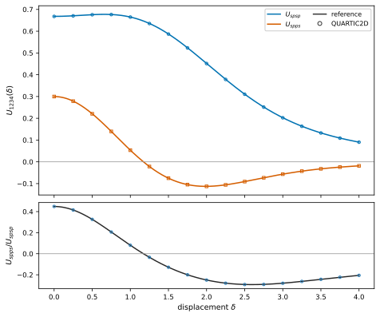

# QUARTIC2D

[](https://github.com/QuantumArtificer/quartic2d/actions/workflows/tests.yml)
[](https://quantumartificer.github.io/quartic2d/)
[](LICENSE)

**QUARTIC2D — Quadrature for Radial Tetra-center Interaction Coefficients in 2D —** evaluates general four-center interaction tensors for localized two-dimensional orbital bases.

Localized-orbital descriptions of two-dimensional quantum materials often use Wannier functions, atomic-like orbitals, defect states, quantum-dot states, or other localized basis functions. In such generalized orbital bases, electron-electron interactions are not described by a single density-density parameter: different permutations of four orbital indices generate direct Coulomb terms, exchange, pair hopping, correlated hopping, and related multiorbital couplings. QUARTIC2D evaluates these matrix elements while retaining the anisotropy, sign structure, and complex phase of the underlying orbital products.

For orbitals $\phi_{1},\ldots,\phi_{4}$ and a translationally invariant radial interaction,

$$
U_{1234}=\iint d^{2}\mathbf{r}\,d^{2}\mathbf{r}'\,
\phi_{1}^{*}(\mathbf{r})\phi_{2}^{*}(\mathbf{r}')
U\!\left(\lvert\mathbf{r}-\mathbf{r}'\rvert\right)
\phi_{3}(\mathbf{r})\phi_{4}(\mathbf{r}').
$$

The four orbital indices enter through the transition fields

$$
\rho_{13}=\phi_{1}^{*}\phi_{3},
\qquad
\rho_{42}=\phi_{4}^{*}\phi_{2}.
$$

These fields may be real or complex. The same formulation therefore applies to direct density-density terms, exchange, pair hopping, correlated hopping, and other four-index channels. The current spatial method assumes a scalar radial kernel $U(q)$.

QUARTIC2D expands each transition field in circular harmonics, Hankel-transforms the radial coefficients, and evaluates the remaining one-dimensional momentum integrals for the requested relative displacements. The angular structure of anisotropic and complex orbital products remains explicit throughout the calculation.

Documentation: [quantumartificer.github.io/quartic2d](https://quantumartificer.github.io/quartic2d/)

## Installation

Install the released package from PyPI:

```bash
python -m pip install quartic2d
```

The optional Ogata backend is installed with

```bash
python -m pip install "quartic2d[ogata]"
```

For development:

```bash
git clone https://github.com/QuantumArtificer/quartic2d.git
cd quartic2d
python -m pip install -e ".[test,docs,dev,release,ogata]"
```

QUARTIC2D supports Python 3.10--3.13.

## Quick start

The example below evaluates a direct term and an exchange term for localized $s$ and $p_{x}$ orbitals.

```python
import numpy as np
from petal2d import PolarDecomposition
from quartic2d import HarmonicTransform, Interaction

x = np.linspace(-6.0, 6.0, 181)
y = np.linspace(-6.0, 6.0, 181)


def orbital_s(x, y):
    return np.exp(-0.5 * (x**2 + y**2)) / np.sqrt(np.pi)


def orbital_px(x, y):
    return np.sqrt(2.0 / np.pi) * x * np.exp(-0.5 * (x**2 + y**2))


def transform(field):
    dec = PolarDecomposition(
        field,
        x,
        y,
        Nr=181,
        Ntheta=256,
        rmax=5.5,
        origin=(0.0, 0.0),
    )
    return HarmonicTransform(dec)


def rho_ss(x, y):
    psi = orbital_s(x, y)
    return np.conj(psi) * psi


def rho_pp(x, y):
    psi = orbital_px(x, y)
    return np.conj(psi) * psi


def rho_sp(x, y):
    return np.conj(orbital_s(x, y)) * orbital_px(x, y)


def yukawa(q):
    return 2.0 * np.pi / np.sqrt(q**2 + 0.35**2)


field_ss = transform(rho_ss)
field_pp = transform(rho_pp)
field_sp = transform(rho_sp)

deltas = np.array([[0.0, 0.0], [1.0, 0.0], [2.0, 0.0]])

direct = Interaction(deltas, field_ss, field_pp, yukawa)
exchange = Interaction(deltas, field_sp, field_sp, yukawa)

for delta, ud, ux in zip(deltas, direct.V, exchange.V):
    print(
        f"delta={delta}: "
        f"direct={ud.real:.8f}, exchange={ux.real:.8f}"
    )
```

```text
delta=[0. 0.]: direct=0.66779880, exchange=0.29977663
delta=[1. 0.]: direct=0.66467833, exchange=0.05339600
delta=[2. 0.]: direct=0.45138002, exchange=-0.11276283
```



The complete calculation is in [`examples/four_center_interaction.py`](examples/four_center_interaction.py). The [Getting started](https://quantumartificer.github.io/quartic2d/getting_started.html) page explains the transition fields, kernel convention, displacement vectors, and returned arrays.

## What can be calculated

A four-center orbital integral is specified by the two transition fields. Common choices include:

| Term | Matrix element | Transition fields |
| --- | --- | --- |
| direct interaction | $U_{ijij}$ | $\lvert\phi_{i}\rvert^{2}$ and $\lvert\phi_{j}\rvert^{2}$ |
| exchange | $U_{ijji}$ | $\phi_{i}^{*}\phi_{j}$ and $\phi_{i}^{*}\phi_{j}$ |
| pair hopping | $U_{iijj}$ | $\phi_{i}^{*}\phi_{j}$ and $\phi_{j}^{*}\phi_{i}$ |
| correlated hopping | e.g. $U_{iiij}$ | $\lvert\phi_{i}\rvert^{2}$ and $\phi_{j}^{*}\phi_{i}$ |

The mathematical formulation does not require the fields to be densities or real functions. Benchmark coverage is described separately in the validation documentation.

## Numerical control

The ordinary constructors provide practical default resolutions together with numerical diagnostics:

```python
field = HarmonicTransform(decomposition)
interaction = Interaction(deltas, field1, field2, U_q)
```

When a reported result needs an explicit self-convergence criterion, determine the momentum representation and interaction resolution with the convergence interfaces:

```python
hcal = HarmonicTransform.converge_parameters(
    decomposition,
    rtol=1e-4,
    q_tail_rtol=1e-3,
)
field = hcal.transform(decomposition)

ical = Interaction.converge_parameters(
    deltas,
    field1,
    field2,
    U_q,
    rtol=1e-4,
)
```

The [User guide](https://quantumartificer.github.io/quartic2d/user_guide/) develops the physical inputs first, then q support, interpolation, quadrature, convergence records, and method selection. The [Validation and benchmarks](https://quantumartificer.github.io/quartic2d/validation/) section reports the independent accuracy and performance evidence used to assess those numerical choices.

## Documentation

- [Getting started](https://quantumartificer.github.io/quartic2d/getting_started.html)
- [User guide](https://quantumartificer.github.io/quartic2d/user_guide/)
- [API reference](https://quantumartificer.github.io/quartic2d/reference/)
- [Guided examples](https://quantumartificer.github.io/quartic2d/examples/)
- [Theory](https://quantumartificer.github.io/quartic2d/theory/)
- [Validation and benchmarks](https://quantumartificer.github.io/quartic2d/validation/)
- [Limitations](https://quantumartificer.github.io/quartic2d/limitations.html)
- [Development](https://quantumartificer.github.io/quartic2d/development/)

The public top-level API is intentionally small: `HankelTransform`, `HarmonicTransform`, `Interaction`, `HarmonicConvergenceResult`, and `InteractionConvergenceResult`.

## Validation and tests

Run the unit tests with

```bash
python -m pytest
```

Run the lightweight analytic validation with

```bash
python -m benchmarks.gaussian_validation --quick
```

List the full publication benchmark suite with

```bash
python -m benchmarks.run_suite publication --list
```

The canonical suite covers analytic transform checks, a fixed-field interaction matrix, automatic refinement over standard and large displacement domains, PETAL2D-to-interaction tests, production timing, runtime scaling, and peak memory. Publication result manifests record the Git source state and numerical environment.

## Citation

Citation metadata are provided in [`CITATION.cff`](CITATION.cff). A version DOI will be added after the first archived Zenodo release.

## Contributing

See [`CONTRIBUTING.md`](CONTRIBUTING.md) and the [development documentation](https://quantumartificer.github.io/quartic2d/development/).

## License

QUARTIC2D is distributed under the [MIT License](LICENSE).

Alex Santacruz, 2DQMAT Research @ IF-UNAM
